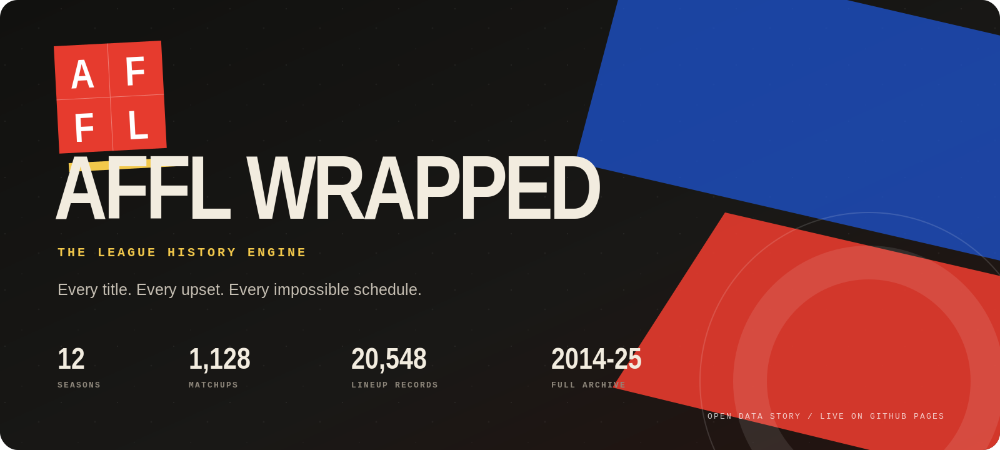
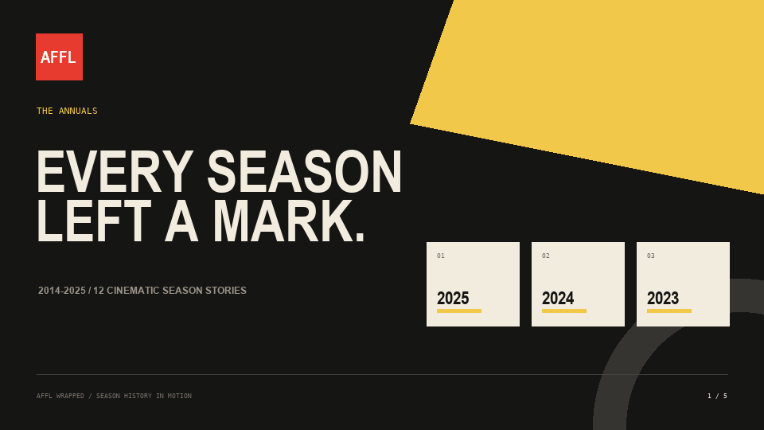
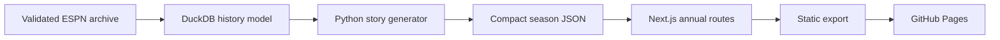

<div align="center">
  <a href="https://rdsciv.github.io/AFFL_Wrapped/">
    
  </a>
</div>

<div align="center">
  <br />
  <a href="https://github.com/rdsciv/AFFL_Wrapped/actions/workflows/deploy-pages.yml"></a>
  <a href="https://github.com/rdsciv/AFFL_Wrapped/actions/workflows/quality.yml"></a>
  <a href="./LICENSE"></a>
  <a href="https://github.com/rdsciv/AFFL_Wrapped/stargazers"></a>
  <a href="https://github.com/rdsciv/AFFL_Wrapped"></a>
</div>

<h3 align="center">Twelve seasons of fantasy football history, rebuilt as a cinematic data story.</h3>

<p align="center">
  <a href="https://rdsciv.github.io/AFFL_Wrapped/"><strong>Explore the live archive</strong></a>
  &nbsp;&middot;&nbsp;
  <a href="./docs/index.mdx">Read the docs</a>
  &nbsp;&middot;&nbsp;
  <a href="https://github.com/rdsciv/AFFL_Wrapped/issues/new?template=feature_request.yml">Request a feature</a>
</p>

<div align="center">
  
</div>

## Not another standings table

Most fantasy history tools archive results. AFFL Wrapped reconstructs the season.

Each annual turns raw ESPN league records into a narrative experience: championship context, all-play power, schedule luck, matchup superlatives, player impact, draft returns, undrafted gems, and a final card for every franchise. It is an opinionated reference implementation for anyone who believes a long-running league deserves more than a spreadsheet.

| Signal | Coverage | What it unlocks |
| --- | ---: | --- |
| Seasons | **2014-2025** | One shareable annual per year |
| Team-seasons | **138** | Finishes, records, points, power, and luck |
| Matchups | **1,128** | Blowouts, nail-biters, fireworks, and title games |
| Lineup records | **20,548** | Player leaders, single-game peaks, and carry share |
| Transactions | **7,487** | Activity context and post-2018 event analysis |
| Data checks | **0 core failures** | Audited season and route generation |

## The experience

- **Season annuals**: twelve editorially designed routes, not a generic dashboard.
- **Power without schedule bias**: all-play expected wins reveal who was actually strongest.
- **Luck with a definition**: actual wins minus expected wins, calculated week by week.
- **Games worth remembering**: title games, biggest blowouts, closest finishes, and combined-score extremes.
- **Player impact**: scoring leaders, weekly eruptions, carry share, draft returns, and waiver gems.
- **Honest provenance**: pre-2018 ESPN draft and event-level transaction limits are disclosed in-product.
- **Static by design**: no database, secret, server, or account is required to explore the archive.

## Architecture



The public site ships only the compact, presentation-ready season stories. Raw API responses, private cookies, and the full historical database are never committed.

## Quick start

```bash
git clone https://github.com/rdsciv/AFFL_Wrapped.git
cd AFFL_Wrapped
npm install
npm run dev
```

Open `http://localhost:3000`. To reproduce the exact GitHub Pages artifact:

```bash
npm test
```

That command creates the static export and verifies the archive page, all twelve annual routes, repository-safe asset paths, and representative story sections.

## Repository map

```text
AFFL_Wrapped/
├── app/        # Routes, components, styles, and compact season stories
├── docs/       # Mintlify-ready product and metric documentation
├── public/     # Brand graphics, animated demo, and favicon
├── scripts/    # Reproducible data and README asset generators
├── tests/      # Static-export contract tests
└── .github/    # CI, Pages, issue forms, and contributor automation
```

## Documentation

The `docs/` directory is ready for Mintlify and useful directly on GitHub:

- [Start here](./docs/index.mdx)
- [Run locally](./docs/quickstart.mdx)
- [Understand the architecture](./docs/architecture.mdx)
- [Read every metric definition](./docs/metrics.mdx)
- [Inspect data coverage and caveats](./docs/data-model.mdx)

## Roadmap

- [ ] Owner identity resolution across renamed franchises
- [ ] Head-to-head rivalry stories and all-time franchise pages
- [ ] Championship roster anatomy and multi-ring player index
- [ ] Share-card export for every team-season
- [ ] Adapter interface for Sleeper and Yahoo histories
- [ ] Automated annual refresh after each fantasy season

See the [open issues](https://github.com/rdsciv/AFFL_Wrapped/issues) or propose the next story module.

## Star history

If this project helps you rethink league history, a star helps other commissioners find it.

<div align="center">
  <a href="https://star-history.com/#rdsciv/AFFL_Wrapped&Date">
    
  </a>
</div>

## Contributing

Ideas, metric critiques, visual refinements, and new platform adapters are welcome. Read [CONTRIBUTING.md](./CONTRIBUTING.md), use the issue forms, and keep changes focused. Every pull request runs linting, a full static export, and route contract tests.

## License

Released under the [MIT License](./LICENSE). League names and historical results remain the property of their respective participants and platforms.

---

<p align="center"><strong>Built for the arguments that never end.</strong></p>
