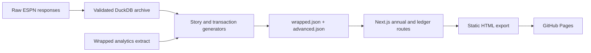

## Pipeline

## Runtime boundary

The public experience is deliberately read-only and serverless. `app/data/wrapped.json` and `app/data/advanced.json` are imported during the build, each season in `generateStaticParams()` becomes an HTML route, and GitHub Pages serves the result from its CDN.

This boundary provides:

- no public credentials;
- no database attack surface;
- deterministic builds;
- permanent season URLs;
- near-zero hosting cost.

## Application surfaces

| Path | Responsibility |
| --- | --- |
| `app/page.tsx` | Annual archive and project entry point |
| `app/wrapped/[season]/page.tsx` | Static route contract for each season |
| `app/transactions/page.tsx` | Searchable transaction and expected-value lab |
| `app/components/` | Editorial sections, cards, tables, and navigation |
| `app/lib/data.ts` | Typed story accessors and formatting helpers |
| `app/lib/advanced.ts` | Typed advanced analytics and transaction accessors |
| `app/data/wrapped.json` | Generated, presentation-ready league history |
| `app/data/advanced.json` | Advanced Wrapped modules and transaction ledger |
| `scripts/generate_wrapped_data.py` | Reproducible warehouse-to-story transformation |
| `scripts/generate_advanced_data.py` | Reproducible advanced and four-week xFP transformation |
